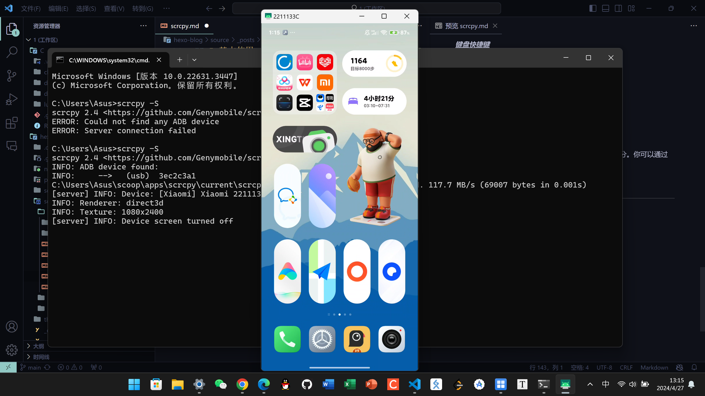

`scrcpy` 是一个开源的应用程序，可以让你通过电脑控制和显示Android设备的屏幕。这里是如何在Windows系统上安装 `scrcpy` 的步骤：

## 1. **下载和安装Scoop**（如果你还没有Scoop）：

   打开命令提示符（CMD）并运行以下命令安装 Scoop（首先需要确保已启用PowerShell的执行策略）：

```bash
Set-ExecutionPolicy RemoteSigned -Scope CurrentUser
iwr -useb get.scoop.sh | iex
```

## 2. **通过Scoop安装scrcpy**：

   在命令提示符中运行以下命令：

```bash
scoop install scrcpy
```

## 3. **安装ADB**（如果还没安装）：

```bash
scoop install adb
```

## 4. **开启“USB调试”**

   确保在连接设备前在Android设备上开启了USB调试模式，通常在“设置” -> “系统” -> “关于手机”里连续点击“版本号”七次后返回“系统”中出现“开发者选项”，在其中开启“USB调试”。

## 5.基本使用

#### <u>*启用镜像*</u>

首先确保你的设备已经开启了USB调试，然后通过USB线连接到电脑。在电脑上打开命令提示符/PowerShell，输入以下命令启动 `scrcpy`：

```bash
scrcpy
```

#### <u>*无线连接*</u>

要通过无线网络使用 `scrcpy`，首先需要连接USB线，然后在命令行中设置设备用于监听TCP/IP连接：

```bash
adb tcpip 5555
```

找出你的Android设备的IP地址，然后断开USB连接，使用以下命令连接：

```bash
adb connect DEVICE_IP:5555
scrcpy
```

替换 `DEVICE_IP` 为你的设备的实际IP地址。

#### <u>*常用选项*</u>

- **调整分辨率**：
  
  ```bash
  scrcpy --max-size 1024
  ```
  
  这将限制设备镜像的最大宽度或高度为1024像素。

- **设置比特率**：
  
  ```bash
  scrcpy --bit-rate 2M
  ```
  
  这将设置传输数据的比特率为2 Mbps。

- **全屏模式**：
  
  ```bash
  scrcpy --fullscreen
  ```
  
  或者使用快捷键 `Ctrl` + `f` 在全屏和窗口模式之间切换。

- **只读模式**：
  
  ```bash
  scrcpy --no-control
  ```
  
  这将禁止从电脑端控制设备。

- **裁剪设备屏幕**：
  
  ```bash
  scrcpy --crop 1920:1080:0:0
  ```
  
  这将只显示设备屏幕的一部分，格式为 `宽度:高度:左:顶`。

- **保持屏幕常亮**：
  
  ```bash
  scrcpy --stay-awake
  ```
  
  这将在连接时保持设备屏幕常亮。

- **显示触摸**：
  
  ```bash
  scrcpy --show-touches
  ```
  
  这将在屏幕上显示物理触摸的位置。

- **息屏显示**
  
  ```bash
  scrcpy --turn-screen-off
  ```
  
  这将在连接时保持设备息屏。

#### <u>*键盘快捷键*</u>

- `Ctrl` + `o` ：关闭或打开设备屏幕。
- `Ctrl` + `p` ：暂停或继续设备屏幕镜像。
- `Ctrl` + `r` ：旋转设备屏幕显示。
- `Ctrl` + `h`/`Home` ：模拟点击Home键。
- `Ctrl` + `b`/`Back` ：模拟点击返回键。
- `Ctrl` + `m`/`Menu` ：模拟点击菜单键。
- `Ctrl` + `s` ：截图保存至默认目录。
- `Ctrl` + `Shift` + `s` ：截图并复制到剪贴板。

`scrcpy` 提供了非常丰富的功能，这些只是其中的一部分。你可以通过运行 `scrcpy --help` 查看更多可用的选项。

## 6.**效果展示**

